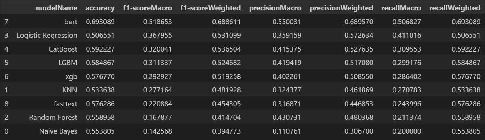

# Yorum Sınıflandırması ve Geçmiş Yorumları Analiz Ederek Genel Kullanıcı Görüşü Oluşturma

## Proje Amacı

Bu projenin amacı, kullanıcı yorumlarını analiz ederek ürün hakkında genel bir görüş oluşturmak ve yeni bir yorumu otomatik olarak 1 ile 5 arasında bir puanla değerlendirmektir. Proje, kullanıcı geri bildirimlerini anlamak ve ürünün genel performansı hakkında bir değerlendirme yapmak için gelişmiş doğal dil işleme (NLP) tekniklerini ve büyük dil modellerini (LLM) kullanmaktadır. 


## Dataset ve Data Preprocess

### Dataset
Projemizde kullanılan veri seti, **Women’s E-Commerce Clothing Reviews** veri setidir. Bu veri seti, kadın giyim ürünlerine ait müşteri yorumlarını ve çeşitli destekleyici özellikleri içermektedir. Veri setinin detayları şu şekildedir:

- **Kaynak**: [Kaggle - Women’s E-Commerce Clothing Reviews](https://www.kaggle.com/datasets/nicapotato/womens-ecommerce-clothing-reviews)
- **Boyut**: 23,486 satır ve 10 özellik.
- **İçerik**:
  - **Clothing ID**: Ürünlere ait benzersiz bir kimlik numarası.
  - **Age**: Yorum sahibinin yaşı.
  - **Title**: Yorum başlığı.
  - **Review Text**: Yorum içeriği.
  - **Rating**: Kullanıcı tarafından verilen puan (1 - En kötü, 5 - En iyi).
  - **Recommended IND**: Ürünün tavsiye edilip edilmediği (1 - Tavsiye, 0 - Tavsiye edilmez).
  - **Positive Feedback Count**: Bu yorumu olumlu bulan diğer kullanıcı sayısı.
  - **Division Name**: Ürünün yüksek düzeyde kategorisi.
  - **Department Name**: Ürünün departman adı.
  - **Class Name**: Ürünün sınıf adı.

#### Puan Dağılımı
- **5 puan**: 12,540 yorum  
- **4 puan**: 4,908 yorum  
- **3 puan**: 2,823 yorum  
- **2 puan**: 1,549 yorum  
- **1 puan**: 821 yorum  


---

### Data Preprocess
Veri işleme aşamaları, ham veriyi model için uygun hale getirmek amacıyla şu adımlardan oluşmaktadır:

1. **Küçük Harfe Çevirme**  
   Tüm metin verisi küçük harflere dönüştürülerek tutarlılık sağlanır.

2. **HTML Etiketlerinden Temizleme**  
   Yorum metinlerinden HTML etiketleri kaldırılarak yalnızca anlamlı içerik bırakılır.

3. **Yabancı Karakterlerin Temizlenmesi**  
   Metindeki özel ve yabancı karakterler temizlenir.

4. **Tokenizasyon**  
   Metin, kelime ya da cümlelere bölünerek analiz için hazırlanır.

5. **Stop Words Kaldırma**  
   Sıklıkla kullanılan ancak anlam taşımayan "ve", "bir", "de" gibi kelimeler çıkarılır.

6. **Lemmatization (Kök Haline Getirme)**  
   Kelimeler kök formlarına dönüştürülerek analizde daha iyi sonuç alınır.

7. **Veri Vektörleştirme**  
   Metin verisi, Spacy'nin **`en_core_web_lg`** modeli kullanılarak vektör formuna dönüştürülür.

8. **Rating Encode (Puanları Sayısal Hale Getirme)**  
   Yorum puanları (Rating), makine öğrenimi modelleri için uygun hale getirilir.

Bu işlemler sonucunda veri seti, yorum sınıflandırması ve genel kullanıcı görüşü analizi için hazır hale getirilir.


## Sınıflandırma Algoritmaları

### Veri Bölme ve Ön İşleme
Veri işleme aşamasında, veri seti eğitim ve test verilerine ayrılmış, ardından normalizasyon işlemi uygulanmıştır. Bu süreç, model performansını artırmak ve dengeli bir veri seti sağlamak amacıyla gerçekleştirilmiştir. 

- Eğitim ve test oranı: %70 / %30  
- Kullanılan ölçeklendirme yöntemi: **MinMaxScaler**

---

### Model Seçimi ve Eğitim
Proje kapsamında aşağıdaki sınıflandırma algoritmaları kullanılmış ve performansları karşılaştırılmıştır:

- **Naive Bayes**  
- **K-Nearest Neighbors (KNN)**  
- **Random Forest**  
- **Logistic Regression**  
- **CatBoost**  
- **LightGBM**  
- **XGBoost**  
- **BERT**  
- **FastText**

Her bir model, yorumları 1-5 arasındaki puanlarla sınıflandırmak üzere eğitilmiştir. Derin öğrenme modelleri (BERT ve FastText) ile klasik makine öğrenimi algoritmalarının performansı analiz edilmiştir.

---

### Model Eğitimi ve Değerlendirilmesi
Eğitim tamamlandıktan sonra modellerin doğruluk, hata oranı ve diğer değerlendirme metrikleri üzerinden performans karşılaştırmaları yapılmıştır. Aşağıdaki grafik, tüm modellerin performansını özetlemektedir:



Görseldeki sonuçlara göre, BERT'in daha yüksek doğruluk ve F1 skoru elde ettiğini görüyoruz. BERT, özellikle metin verisini anlamada ve sınıflandırmada en iyi performansı gösteriyor. Diğer modellerle kıyaslandığında, özellikle F1 skoru (hem makro hem de ağırlıklı) açısından belirgin bir üstünlüğü var.


## LLM İle Genel Kullanıcı Görüşü Oluşturma

Proje kapsamında, büyük dil modelleri (LLM'ler) kullanılarak yorumların analiz edilmesi ve ürünler hakkında genel bir kullanıcı görüşü oluşturulması hedeflenmiştir. Kullanılan modeller ve özellikleri aşağıdaki gibidir:

1. **GPT**
   - **Token Limiti**: 128,000  
   - **Model Adı**: GPT-4o mini  
   - Kullanıcı yorumlarının analizinde yüksek doğruluk ve geniş bağlam işleme kapasitesine sahiptir.

2. **Llama**
   - **Token Limiti**: 128,000  
   - **Model Adı**: meta-llama/Llama-3.2-1B-Instruct  
   - Daha hafif bir model olmasına rağmen güçlü bağlam analizi sunar.

3. **QWEN**
   - **Token Limiti**: 32,768  
   - **Model Adı**: Qwen/Qwen2-1.5B-Instruct  
   - Özellikle kısa ve öz yorumlarda etkili sonuçlar üretir.


  
## API Kullanımı

#### Ürün id - ürün yorum sayısı - ürün ortalama puanı getirir.

```http
  GET /dressInformations
```


#### Örnek 3 Yorum Getir
```http
  GET /exampleReviews
```

| Parametre | Tip     | Açıklama                |
| :-------- | :------- | :------------------------- |
| `productId` | `int` | **Gerekli**. Örnek yorumların hangi üründen geliceğini belirtir. |


#### Yorum Sınıflandırma

```http
  POST /classifyReview
```

| Parametre | Tip     | Açıklama                |
| :-------- | :------- | :------------------------- |
| `reviewText` | `string` | **Gerekli**. Örnek yorumların hangi üründen geliceğini belirtir. |


#### GPT ile Genel Kullanıcı Görüşü Oluşturma

```http
  GET /gpt/conclusionGenerate
```
| Parametre | Tip     | Açıklama                |
| :-------- | :------- | :------------------------- |
| `productId` | `int` | **Gerekli**. Oluşturulacak genel kullanıcı görüşü ürününün kimlik numarası. |


#### LLAMA ile Genel Kullanıcı Görüşü Oluşturma

```http
  GET /llama/conclusionGenerate
```
| Parametre | Tip     | Açıklama                |
| :-------- | :------- | :------------------------- |
| `productId` | `int` | **Gerekli**. Oluşturulacak genel kullanıcı görüşü ürününün kimlik numarası. |


## config.json Dosyasını Oluşturma

Projeye erişim sağlamak ve API'leri kullanabilmek için kullanıcıların `config.json` dosyasını oluşturup içerisine gerekli API anahtarlarını eklemeleri gerekmektedir.

#### 1. config.json Dosyasını Oluşturun

Bir metin düzenleyicisi (örneğin Notepad veya VSCode) kullanarak yeni bir dosya oluşturun ve ismini `config.json` olarak kaydedin.

#### 2. API Anahtarlarını config.json Dosyasına Ekleyin

Aşağıdaki örnekteki gibi, `config.json` dosyasına gerekli verileri ekleyin:

```json
{
    "HF_TOKEN": "PASTE_HUGGİNGFACE_TOKEN",
    "GPT_API_KEY": "PASTE_GPT_API_KEY"
}
```

## Projeyi Başlatma

Projeyi başlatmak için aşağıdaki adımları takip edebilirsiniz:

### 1. Uvicorn ile Sunucuyu Başlatma

Projeyi başlatmak için terminali açın ve projenizin bulunduğu dizine gidin. Ardından aşağıdaki komutu çalıştırarak FastAPI uygulamanızı başlatın:

```bash
uvicorn main:app
```

### 2. Web Uygulamasını Tarayıcıda Açma

Sunucuyu başarıyla başlattıktan sonra, `webApp/index.html` dosyasını tarayıcınızda açarak web uygulamanızı görüntüleyebilirsiniz. 


  